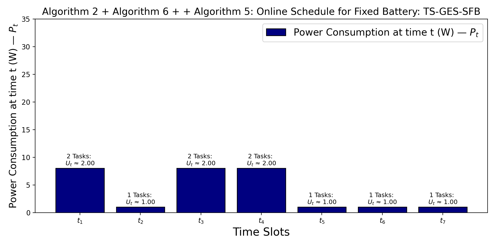

# Maximizing Revenue in Roadside Green Edge Server System

This repository contains the codebase and datasets for the proposed work on task scheduling in solar-powered Green Edge Server Systems (GESS) to support autonomous vehicles.

---

## 📁 Directory Structure

### 1. `Dataset/`
Contains all the datasets used in the experiments.

#### └─ `Single Day/`
- **Power/**
  - `power_predicted.csv`: Predicted solar power profile throughout the day.
  - `power_actual_5_percent_deviation.csv`: 5% deviation from predicted solar power.
  - `power_actual_10_percent_deviation.csv`: 10% deviation from predicted solar power.

- **Task/**
  - Each `rho` folder (e.g., `rho 0.03/`, `rho 0.05/`, ...) contains:
    - `task_predicted.csv`: Predicted task profile.
    - `task_actual_5_percent_deviation.csv`: 5% deviation for existing tasks.
    - `task_actual_10_percent_deviation.csv`: 10% deviation for existing tasks.
    - `task_new_5_percent_deviation.csv`: 5% deviation with new unpredicted tasks.
    - `task_new_10_percent_deviation.csv`: 10% deviation with new unpredicted tasks.

#### └─ `Multiple Day/`
- **Power/**
  - `power_predicted.csv`: Predicted solar power across 7 days.
- **Task/**
  - Folders for different rho values (e.g., `rho 0.03`, `rho 0.1`, `rho 0.18`) contain:
    - `task_predicted.csv`: Multi-day task profile.

---

### 2. `Code/`
Contains the implementation of all scheduling algorithms.

#### └─ `offline/`
- `infinitebattery_offline.cpp`: Implements Algo 2 + Algo 4.
- `finitebattery_offline.cpp`: Implements Algo 2 + Algo 6.

#### └─ `online/`
- `online_solar_infinite_battery.cpp`: Implements Algo 2 + Algo 4 + Algo 5.
- `online_solar_finitebattery.cpp`: Implements Algo 2 + Algo 6 + Algo 5.

#### └─ `stateofart/`
Baseline methods from the literature:
- `NPEDF_*`: Non-preemptive Earliest Deadline First (finite/infinite battery).
- `EA_*`: Execute-on-Arrival methods.
- `asap_HUF_*`: As Soon As Possible – Highest Utilization First.
- `asap_LUF_*`: As Soon As Possible – Lowest Utilization First.

---

## 🔧 Usage

- **Compile the C++ files** with `g++`:
  ```bash
  g++ infinitebattery_offline.cpp -o infinitebattery
  ./infinitebattery

# ☀️ Toy Example: Solar-Powered Task Scheduling Visualization

This repository provides a **toy example** demonstrating how solar power availability, task validity, and scheduling evolve over discrete time slots under different algorithmic settings.  
It visualizes how the system schedules tasks in the presence (or absence) of solar energy and battery support.

---

## 📁 Figures Overview

### 1️⃣ Incoming Solar Power (Predicted)


**Description:**  
This figure shows the **predicted incoming solar power** (`S_t`) at each time slot.  
It represents the renewable energy available to the system over time.

---

### 2️⃣ Incoming Predicted Tasks and Their Validity


**Description:**  
This figure visualizes the **predicted tasks arriving at each time slot** and their **validity** extending across adjacent slots.  
- **Dark Blue Cells:** Tasks that arrived in the current time slot.  
- **Light Blue Cells:** Tasks carried over from the previous slot (still valid).  
Each cell corresponds to one task (τ₁, τ₂, …), and the total number of valid tasks is shown on top of each bar.

---

### 3️⃣ Algorithm 2 (No Battery): Solar Availability and Scheduled Tasks


**Description:**  
This plot represents **Algorithm 2 (No Battery)**, where tasks are scheduled only when solar power is directly available.  
It shows how power consumption (`P_t`) corresponds to solar input (`S_t`) at each slot.

---

### 4️⃣ Algorithm 2 + Algorithm 4: Offline Schedule for Infinite Battery (TS-GES-SIB)


**Description:**  
This figure corresponds to the **offline scheduling** scenario with an **infinite battery**.  
Excess solar energy from earlier slots can be stored and used later, ensuring smoother task execution and balanced utilization across time.

---

### 5️⃣ Algorithm 2 + Algorithm 6 + Algorithm 5: Online Schedule for Fixed Battery (TS-GES-SFB)


**Description:**  
This plot shows the **online scheduling** case with a **fixed battery capacity**, where task execution adapts dynamically based on real-time solar input and storage limits.

---

## 🧠 Concept Summary

| Symbol | Meaning |
|:-------:|:--------|
| `S_t` | Incoming solar power at time slot *t* |
| `P_t` | Power consumption at time slot *t* |
| `U_t` | System utilization at time slot *t* |
| `τ_i` | Task *i* |

---

## ⚙️ How to Reproduce the Plots

To regenerate the figures locally, run the provided Python scripts in sequence (each corresponds to one figure):

```bash
python plot_solar_power.py
python plot_incoming_tasks.py
python plot_algorithm2.py
python plot_algorithm4.py
python plot_algorithm6.py


## Preprint version
https://arxiv.org/abs/2410.16724
