# Maximizing Revenue in Roadside Green Edge Server System

This repository contains the codebase and datasets for the proposed work on task scheduling in solar-powered Green Edge Server Systems (GESS) to support autonomous vehicles.

---

## 📁 Directory Structure

### 1. `Dataset/`
Contains all the datasets used in the experiments.

#### └─ `Single Day/`
- **Power/**
  - `power_predicted.csv`: Predicted solar power profile throughout the day.
  - `power_actual_5_percent_deviation.csv`: 5% deviation from predicted solar power.
  - `power_actual_10_percent_deviation.csv`: 10% deviation from predicted solar power.

- **Task/**
  - Each `rho` folder (e.g., `rho 0.03/`, `rho 0.05/`, ...) contains:
    - `task_predicted.csv`: Predicted task profile.
    - `task_actual_5_percent_deviation.csv`: 5% deviation for existing tasks.
    - `task_actual_10_percent_deviation.csv`: 10% deviation for existing tasks.
    - `task_new_5_percent_deviation.csv`: 5% deviation with new unpredicted tasks.
    - `task_new_10_percent_deviation.csv`: 10% deviation with new unpredicted tasks.

#### └─ `Multiple Day/`
- **Power/**
  - `power_predicted.csv`: Predicted solar power across 7 days.
- **Task/**
  - Folders for different rho values (e.g., `rho 0.03`, `rho 0.1`, `rho 0.18`) contain:
    - `task_predicted.csv`: Multi-day task profile.

---

### 2. `Code/`
Contains the implementation of all scheduling algorithms.

#### └─ `offline/`
- `infinitebattery_offline.cpp`: Implements Algo 2 + Algo 4.
- `finitebattery_offline.cpp`: Implements Algo 2 + Algo 6.

#### └─ `online/`
- `online_solar_infinite_battery.cpp`: Implements Algo 2 + Algo 4 + Algo 5.
- `online_solar_finitebattery.cpp`: Implements Algo 2 + Algo 6 + Algo 5.

#### └─ `stateofart/`
Baseline methods from the literature:
- `NPEDF_*`: Non-preemptive Earliest Deadline First (finite/infinite battery).
- `EA_*`: Execute-on-Arrival methods.
- `asap_HUF_*`: As Soon As Possible – Highest Utilization First.
- `asap_LUF_*`: As Soon As Possible – Lowest Utilization First.

---

### 3. `Usage`

- **Compile the C++ files** with `g++`:
  ```bash
  g++ infinitebattery_offline.cpp -o infinitebattery
  ./infinitebattery

## Toy Example: Solar-Power Charging-Discharging Scheduling

This repository presents a **toy example** that demonstrates how solar-powered task scheduling behaves under **predicted** and **actual** conditions across various battery capacities.

It showcases the scheduling and utilization patterns across different algorithms:
- **Offline Scheduling** (Infinite and Finite Battery) using **Predicted Inputs** (Solar Power, Task Arrivals)
- **Online Scheduling** (Infinite and Finite Battery) using **Actual Power Conditions** (Solar Power, Task Arrivals)

---

### ⚙️ Experimental Setup and Simplifications

To focus on visualization and conceptual understanding (not numeric optimization), the following simplifications are made:

| Parameter | Description | Value (Assumed for Ease of Calculation) |
|:----------:|:-------------|:--------------------------------------|
| $P_S$ | Static Power (Base Power) | 0 |
| $U^{max}$ | Maximum Utilization per Slot | 3 |
| $P^{max}$ | Maximum Power Capacity | 27 |
| Task Utilization | All tasks have utilization = 1 | $u_i$ = 1, $\forall$ i
| $P_{avg}$ | Average Power (Formula Below) | **8 (toy case)** instead of actual 5 for this case |

$P_{avg} \gets \frac{\sum_{t=1}^{T_{total}} F_P(U_t)}{T_{total}} = \frac{35}{7} = 5$

For ease of visualization, we use $P_{avg}=8$ in this toy setup.

The example also automatically accounts for **different task prediction errors, utilization demands, and variable deadlines**, though these are simplified here.

---

### Predicted Inputs ☀️🌤️🌦️🌤️🌥️🌦️☀️

#### **1️⃣ Predicted Incoming Solar Power**
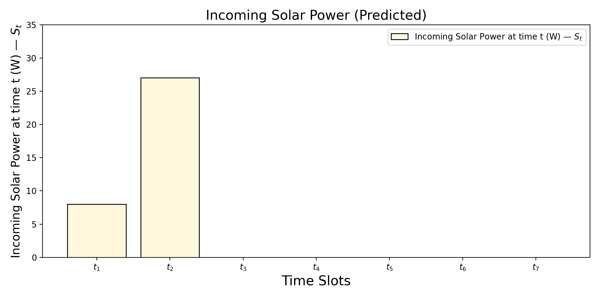

This plot shows the **predicted solar energy input** ($S_t$) at each time slot — representing the renewable power available to the system.

---

#### **2️⃣ Predicted Task Arrivals and Validity**
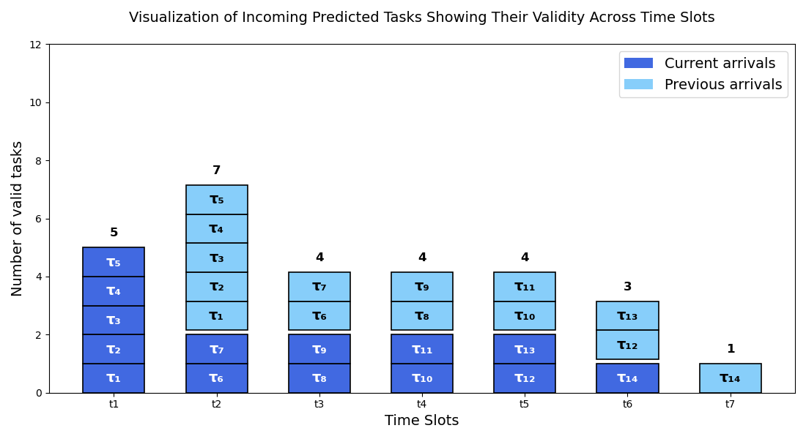

This figure visualizes the **predicted task arrivals** and their **validity periods** across consecutive slots.  
- **Dark Blue:** Newly arrived tasks.  
- **Light Blue:** Tasks valid from the previous slot.  
Each cell represents one task (τ₁, τ₂, …), and the top number shows the total number of valid tasks per time slot.

---
### `Intermediate Step: No-Battery Scheduling`

#### **3️⃣ Algorithm 2 (No Battery): Solar Availability and Scheduled Tasks**
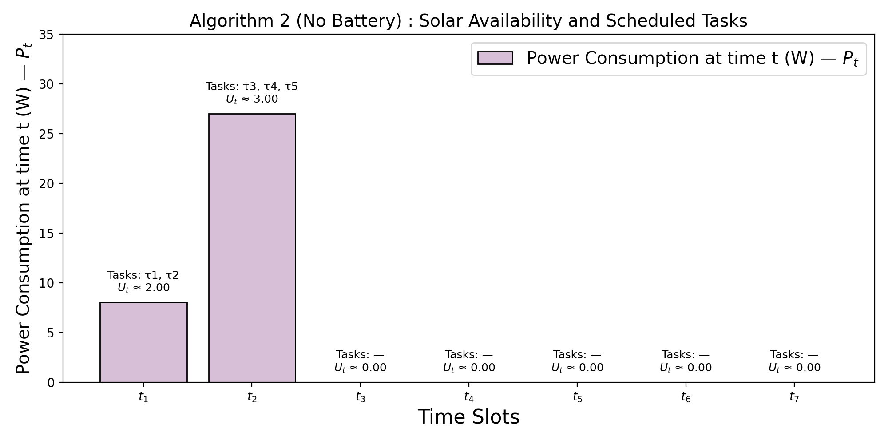

This is an **intermediate scheduling step** where no battery is used.  
Tasks are scheduled **only when solar energy is directly available**, ensuring that:
- Power consumption ($P_t$) strictly follows available solar power.
- Idle slots occur when no solar power is predicted.

This baseline serves as the foundation for later algorithms that introduce energy storage.

___

### `Offline Scheduling`

#### **4️⃣ Infinite Battery Case (Offline Scheduling)**
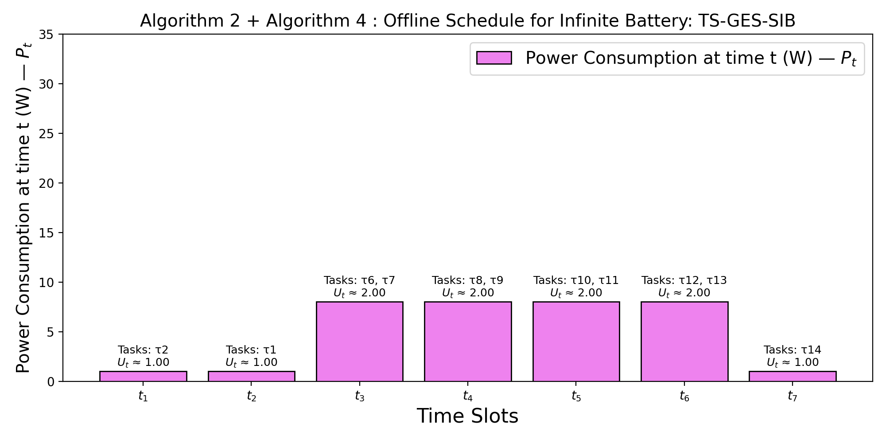

The **offline schedule for infinite battery (TS-GES-SIB)** assumes that all surplus solar energy can be stored and reused later.  
This creates a balanced power utilization pattern while ensuring all predicted tasks are scheduled efficiently.

---

#### **5️⃣ Finite Battery Cases (Offline Scheduling)**

Since real batteries have limited capacity, we visualize **five different capacities**:  
**8, 16, 17, 18, and 19 units (W-time-slot)**.

| 8 Units | 16 Units | 17 Units | 18 Units | 19 Units |
|:--------:|:---------:|:---------:|:---------:|:---------:|
| 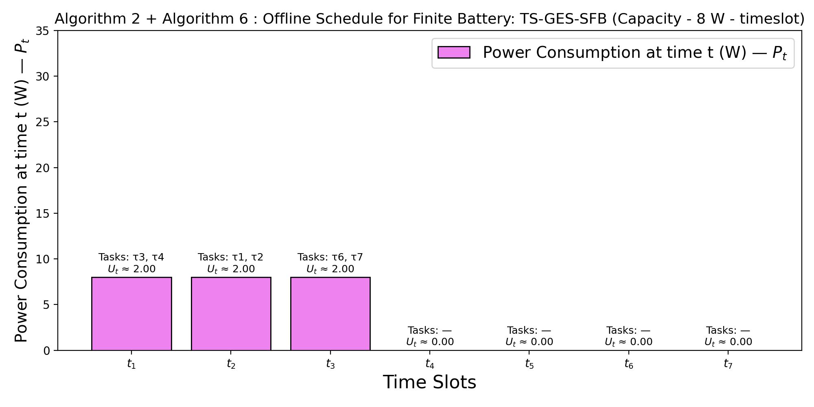 | 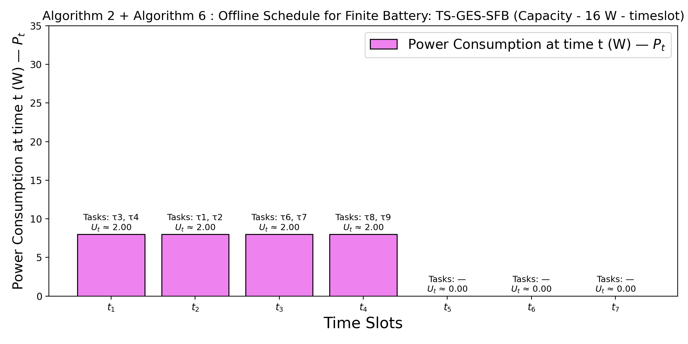 |  | 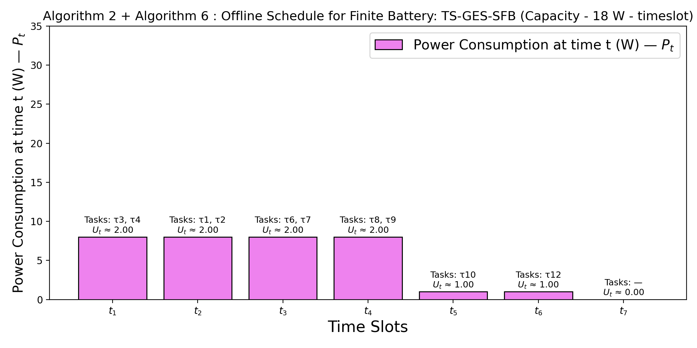 | 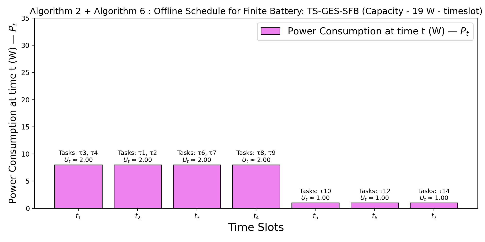 |

Each bar represents the **power consumption at time t ($P_t$)** with corresponding **scheduled tasks and utilization ($U_t$)**.  
The scheduler optimizes based on available solar energy and the finite storage capacity.

---

### Actual Scenarios ☀️🌤️☀️🌦️🌤️🌥️🌦️

#### **6️⃣ Actual Solar Power (Infinite Battery Case)**
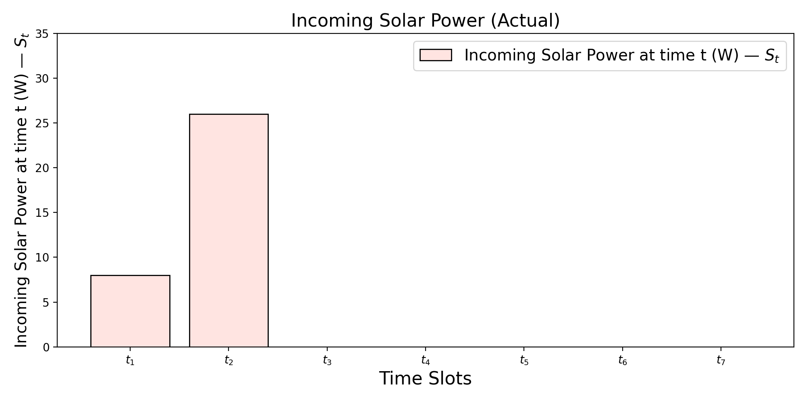

This plot represents the **actual observed solar input** ($S_t$) for the infinite-battery case.  
It may differ slightly from the predicted curve due to uncertainty or environmental variation.

---

### `Online Scheduling`

#### **7️⃣ Online Scheduling — Infinite Battery**
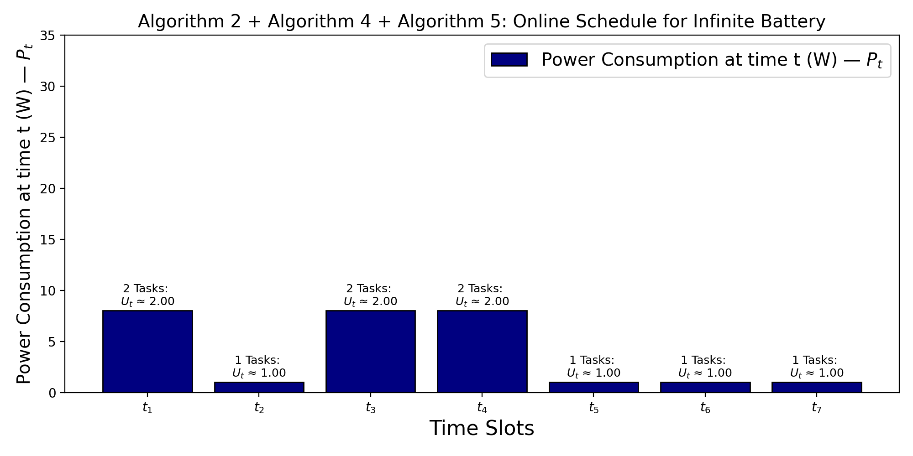

This figure shows the **online version** of the infinite-battery case, where scheduling decisions are taken adaptively as actual solar input is revealed in real-time.

---

### Actual Scenarios ☀️🌤️☀️🌦️🌤️🌥️🌦️

#### **8️⃣ Actual Solar Power (Finite Battery Case)**
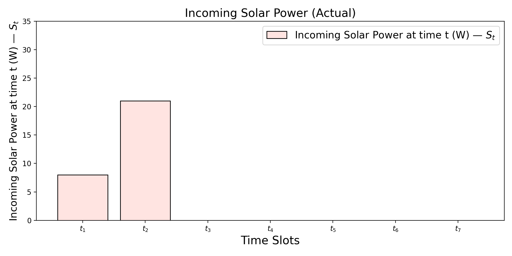

This figure shows the **actual solar energy availability** for the finite-battery case.  
Despite variations from the predicted solar profile, the scheduler dynamically handles charging, discharging, and task placement decisions.

---

### `Online Scheduling`

#### **9️⃣ Finite Battery — Online Scheduling (5 Capacities)**

Since real batteries have limited capacity, we visualize **five different capacities**:  
**8, 16, 17, 18, and 19 units (W-time-slot)**.

| 8 Units | 16 Units | 17 Units | 18 Units | 19 Units |
|:--------:|:---------:|:---------:|:---------:|:---------:|
| 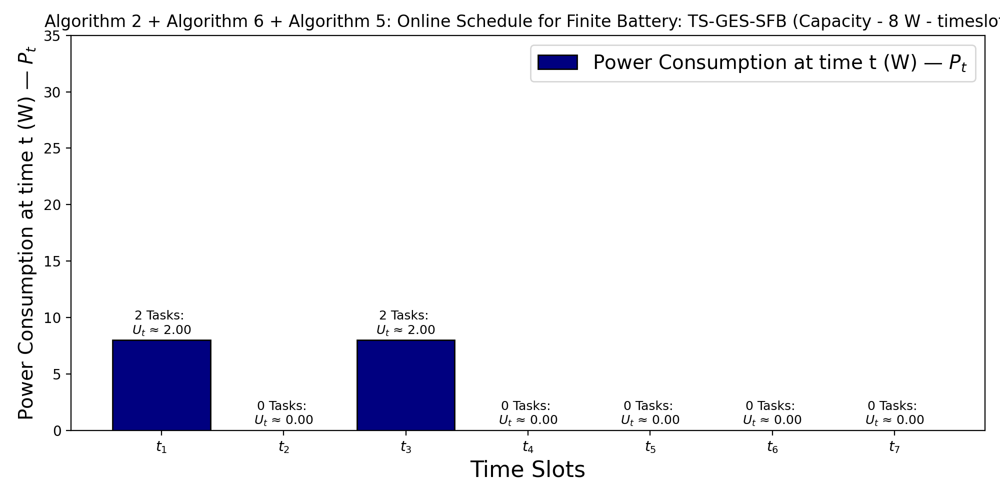 | 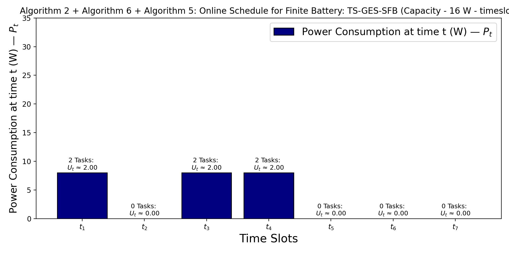 | 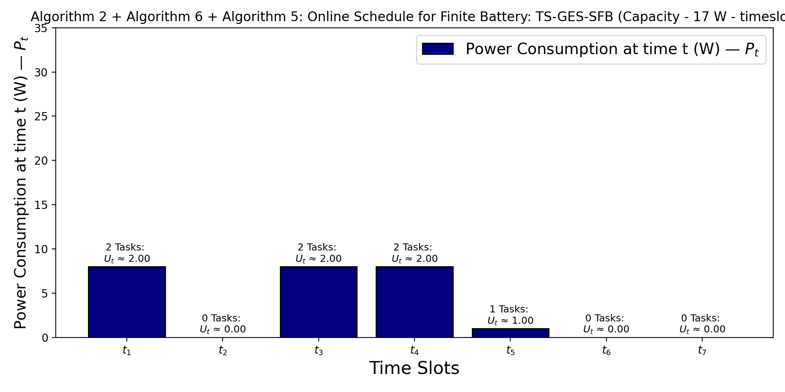 | 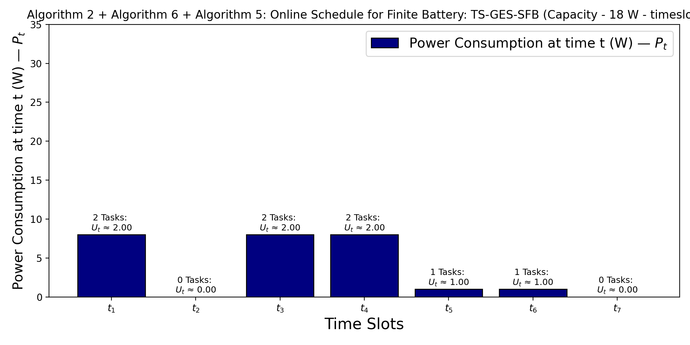 | 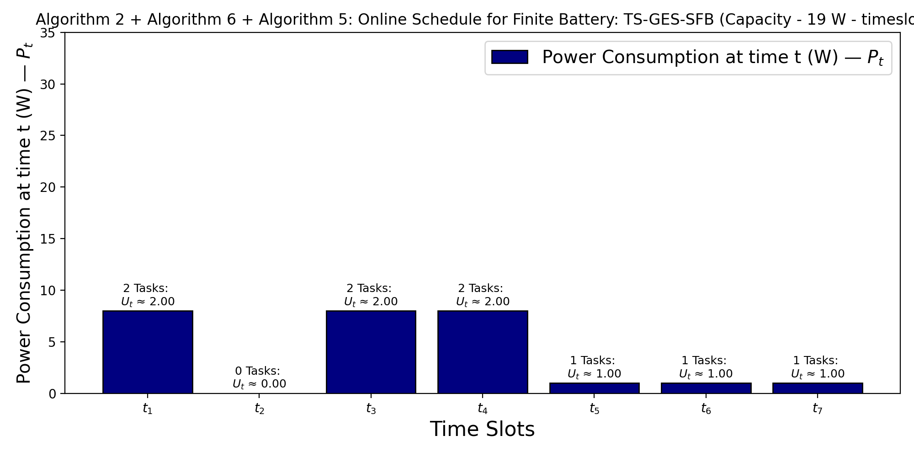 |

Even with prediction differences and limited battery capacity, the online algorithms efficiently adjust charging/discharging and task scheduling to maintain feasibility.

---

#### **1️⃣0️⃣ Key Takeaways**

- The **predicted** and **actual** solar/task profiles differ, but the scheduling algorithm adapts gracefully.  
- **Infinite battery** ensures smooth utilization, while **finite batteries** exhibit constrained but controlled performance.  
- The toy example intentionally simplifies:
  - Constant utilization (1 per task)  
  - Fixed $P_S=0$, $U^{max}=3$, $P^{max}=27$  
  - Average power $P_{avg}=8$ (toy assumption)  

---

## 🔗 Preprint version
https://arxiv.org/abs/2410.16724
